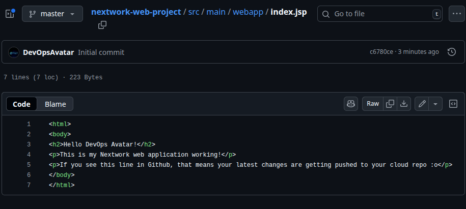

<<<<<<< HEAD
# cloud-architecture-projects-AWS-Azure-GCP
Cloud Architecture Projects (AWS &amp; Azure & GCP) A collection of hands-on projects designing and deploying scalable, secure, and resilient cloud infrastructure using AWS, Azure and GCP. Focused on real-world architecture patterns, best practices, and automation.
=======
nextwork.org

Connect a GitHub Repo with AWS Dennis Chigozirim

Dennis Chigozirim NextWork Student

nextwork.org

Introducing Today's Project! In this project, I will demonstrate Set up
Git and GitHub. Connect your web app project to a GitHub repo inside
AWS, I'm doing this project to learn connect a GitHub repo with AWS.

Key tools and concepts Services I used were EC2 instance, Git and
GitHub, Key concepts I learnt include how to spin up an EC2 instance,
how to install files inside of it and how to install and use git for
version control and also how to initialize and connect with GitHub.

Project reflection This project took me approximately 3 hours The most
challenging part was reconnecting to my EC2 and connecting my EC2 with
GitHub. It was most rewarding to complete every task that was given in
the project. I did this project because I wanted to learn how to use an
EC2 intance and also how connect it with GitHub using Git commands.

Dennis Chigozirim NextWork Student

nextwork.org

This project is part two of a series of DevOps projects where I'm
building a CI/CD pipeline! I'll be working on the next project tomorrow
by God's grace. Thanks.

Dennis Chigozirim NextWork Student

nextwork.org

Git and GitHub Git is Git is like a time machine and filing system for
your code. It tracks every change you make inside your code. I installed
Git using the commands sudo dnf update -y sudo dnf install git -y GitHub
is GitHub is a place for engineers to store and share their code and
projects online. I'm using GitHub in this project to store different
version of my projects that Git tracks.

Dennis Chigozirim NextWork Student

nextwork.org

My local repository A Git repository are folders that contain all your
project files and their entire version history. Git init is a commandit
sets up the directory as a local Git repository which means changes are
now tracked for version control. I ran git init in my project directory
to turn it to a local repository so that my projects can be versioned by
Git. A branch in Git is a parallel versions of the same project. After
running git init, the response from the terminal was a bunch of yellow
texts giving me heads up about naming my main branch master.

Dennis Chigozirim NextWork Student

nextwork.org

To push local changes to GitHub, I ran three commands git add The first
command I ran was git add . A staging area is is like a buffer zone
between your working directory and the repository.

git commit The second command I ran was git commit -m "Updated index.jsp
with new content" Using '-m' means' it lets you leave a message
describing what the commit is about, making it easier to review what
changed in this version.

git push The third command I ran was git push -u origin master Using
'-u' means' you're also setting an 'upstream' for your local branch,
which means you're telling Git to remember to push to master by default.

Dennis Chigozirim NextWork Student

nextwork.org

Authentication When I commit changes to GitHub, Git asks for my
credentials because Git needs to double check that you have the right to
push any changes to the remote origin your local repo is connected with.

Local Git identity Git needs my name and email because Git needs author
information for commits to track who made what change. Running git log
showed me (HEAD -\> master, origin/master) Author: EC2 Default User
<ec2-user@ip-172-31-16-209.eu-north-1.compute.internal> Date: Wed Aug 20
21:50:47 2025 +0000 Updated index.jsp with new content

Dennis Chigozirim NextWork Student

nextwork.org

GitHub tokens GitHub authentication failed when I entered my password
because GitHub phased out password authentication to connect with
repositories over HTTPS. Passwords are too risky and can be intercepted
over the internet very easily. A GitHub token is A token expiration
limit is how long your personal access token would work for. I'm using
one in this project because I want to secure access my GitHub repo. I
could set up a GitHub token by I could set up a GitHub token by going to
GitHub Settings → Developer settings → Personal access tokens → Generate
new token, selecting scopes, and copying it for Git operations.

Dennis Chigozirim NextWork Student

nextwork.org

Dennis Chigozirim NextWork Student

nextwork.org

Making changes again I wanted to see Git working in action, so I updated
index.jsp file. which is the file in ouir web app that defines both html
content i.e the static element that goes into our web apps code as well
any code that goes into the file. I saw the changes in my GitHub repo
after using the git config --global credential.helper store command and
editing in my name and public access token.

nextwork.org

The place to learn & showcase your skills Check out nextwork.org for
more projects



## Extracted Screenshots

>>>>>>> 2cc0c9c (Add AWS DevOps README with screenshots)
